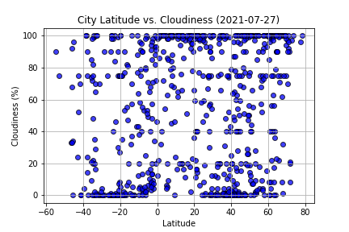
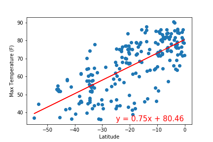
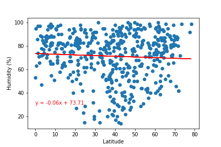
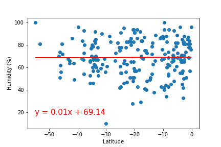
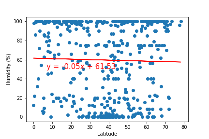
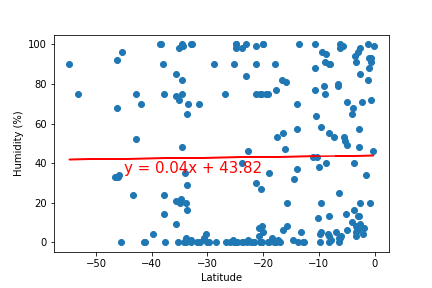

### Weather-API
#### <i> An analysis of weather patterns in relation to the equator</i>

----------------------

**Description:**

I used Python APIs, Matplotlib, GMaps, and Pandas to analyze weather patterns in relation to the equator. Specifically Wind Speed, Cloudiness, Humidity, and Maximum Temperature. I then used this informaton to determine hotels in loactions with ideal weather.

<b>Datasets used:</b>

* [City Data](output_data/city_data.csv)

### Tools used:
----------------------

  - Python
  - Pandas
  - Matplotlib
  - Jupyter
  - Citipy
  - Numpy
  - Scipy
  - pprint
  - Weather API
  - JSON
  - GMaps

### Analysis:
----------------------

#### Scatter Plots

* Temperature (F) vs. Latitude
* Humidity (%) vs. Latitude
* Cloudiness (%) vs. Latitude
* Wind Speed (mph) vs. Latitude

#### Linear Regressions

* Northern Hemisphere - Temperature (F) vs. Latitude
* Southern Hemisphere - Temperature (F) vs. Latitude
* Northern Hemisphere - Humidity (%) vs. Latitude
* Southern Hemisphere - Humidity (%) vs. Latitude
* Northern Hemisphere - Cloudiness (%) vs. Latitude
* Southern Hemisphere - Cloudiness (%) vs. Latitude
* Northern Hemisphere - Wind Speed (mph) vs. Latitude
* Southern Hemisphere - Wind Speed (mph) vs. Latitude

#### Heat Maps
* Humidity by City
* Ideal Hotel Markers
  * A max temperature lower than 80 degrees but higher than 70
  * Wind speed less than 10 mph
  * Zero cloudiness

###  Data Visualization:
----------------------

#### Temperature (F) vs. Latitude

#### Humidity (%) vs. Latitude

#### Cloudiness (%) vs. Latitude

#### Wind Speed (mph) vs. Latitude

#### Northern Hemisphere - Temperature (F) vs. Latitude

#### Southern Hemisphere - Temperature (F) vs. Latitude

#### Northern Hemisphere - Humidity (%) vs. Latitude

#### Southern Hemisphere - Humidity (%) vs. Latitude

#### Northern Hemisphere - Cloudiness (%) vs. Latitude

#### Southern Hemisphere - Cloudiness (%) vs. Latitude

#### Northern Hemisphere - Wind Speed (mph) vs. Latitude

#### Southern Hemisphere - Wind Speed (mph) vs. Latitude

#### Heat Map - Humidity

#### Heat Map - Ideal Hotel Markers
